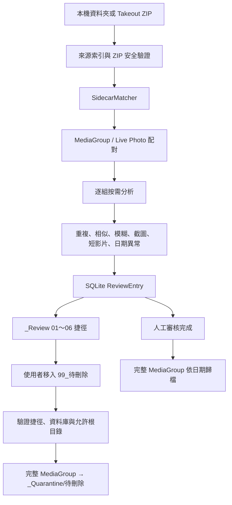

# Smart-Photo-Organizer v3.0 最終架構

## 一、核心模組

| 模組 | 責任 |
|---|---|
| `main.py` | PyWebView WebBridge、DateParser、Windows `.lnk` 與本機媒體後設資料 fallback |
| `takeout_zip.py` | ZIP 唯讀掃描、安全檢查與單檔串流解壓驗證 |
| `source_index.py` | 一般資料夾／Takeout ZIP 統一唯讀來源索引；排除管理目錄與 Reparse Point |
| `sidecar_matcher.py` | 一般資料夾、同 ZIP 與跨 ZIP Sidecar 配對；歧義與 JSON 獨佔控制 |
| `media_group.py` | MediaGroup、Live Photo 及 RAW/JPEG 配對與決定性群組 ID |
| `review_workspace.py` | `_Review`、`_ReviewCache`、捷徑與 SQLite ReviewEntry |
| `review_classifier.py` | 重複、模糊、截圖及短影片人工審核候選 |
| `similarity.py` | 時間／尺寸分桶與 dHash 分段索引；排除完全重複 |
| `date_review.py` | 日期異常審核與原子更新 `date_audit.csv` |
| `quarantine_manager.py` | `99_待刪除` 至 Quarantine 的整組兩階段搬移與續傳 |
| `archive_manager.py` | MediaGroup 日期歸檔、零覆寫共同後綴與續傳 |
| `import_state.py` | Schema v8 SQLite 工作、群組、審核及交易權威狀態 |
| `v3_pipeline.py` | 串接分析、按需解壓、審核、Quarantine 與日期歸檔 |
| `index.html` | v3.0 非技術單頁介面與預覽確認流程 |

## 二、模組依賴方向

```text
index.html → WebBridge(main.py) → V3Pipeline
V3Pipeline → source_index → takeout_zip
V3Pipeline → SidecarMatcher → MediaGroupBuilder
V3Pipeline → ReviewClassifier / SimilarPhotoDetector / DateAnomalyReviewer
V3Pipeline → QuarantineManager / MediaArchiveManager
上述狀態模組 → TakeoutStateManager(import_state.py)
```

依賴由 UI 與協調器指向領域模組；領域模組不反向匯入 `main.py`。

## 三、資料流



## 四、SQLite 權威資料

- `jobs`、`archives`、`members`、`sidecar_links`：既有 Takeout 基線與續傳。
- `media_groups`、`media_group_members`：群組日期、來源、角色與狀態。
- `review_entries`：分類、分數、原因、捷徑與快取路徑。
- `quarantine_actions`、`quarantine_items`：隔離群組與逐檔交易。
- `archive_actions`、`archive_items`：日期歸檔群組與逐檔交易。

SQLite 是唯一權威狀態；資料夾名稱、捷徑檔名與 UI 顯示都不是識別主鍵。

## 五、MediaGroup 資料模型

```text
MediaGroup
├─ group_id / job_id / source_type
├─ primary_media
├─ members[]
│  ├─ PRIMARY / LIVE_PHOTO_VIDEO / RAW_PAIR
│  └─ GOOGLE_JSON
├─ capture_date / confidence / conflict
└─ status
```

## 六、捷徑與安全邊界

- `.lnk` 只指向本機來源媒體或受管理 `_ReviewCache`，不指向 ZIP 虛擬路徑。
- 捷徑檔名可讀，但處理時以 SQLite `review_entry_id` 與 `group_id` 為準。
- 「處理待刪除」只接受已登記、確實位於 `99_待刪除` 且目標落在允許根目錄的捷徑。
- 同一群組即使出現在多個分類也只處理一次。
- 正式搬移先複製、fsync、核對容量與 SHA-256，整組驗證成功後才移除來源。
- Takeout 模式只處理按需實體化快取；原始 ZIP 永遠不修改、不改名、不刪除。

## 七、已收斂的舊設計

1. v3.0 UI 不再暴露舊版直接 Copy／Move 流程，改為「分析 → 審核 → Quarantine／歸檔」。
2. 截圖、模糊、相似、短影片與日期異常全部只建立捷徑候選。
3. Sidecar 配對集中於 `SidecarMatcher`；舊 Processor 僅保留相容入口。
4. Live Photo／RAW 已升級為可交易 MediaGroup，所有正式處理均整組執行。
5. OneDrive／Google Drive placeholder 防下載程式與 UI 已移除；Windows Shell 僅保留捷徑與本機後設資料用途。
