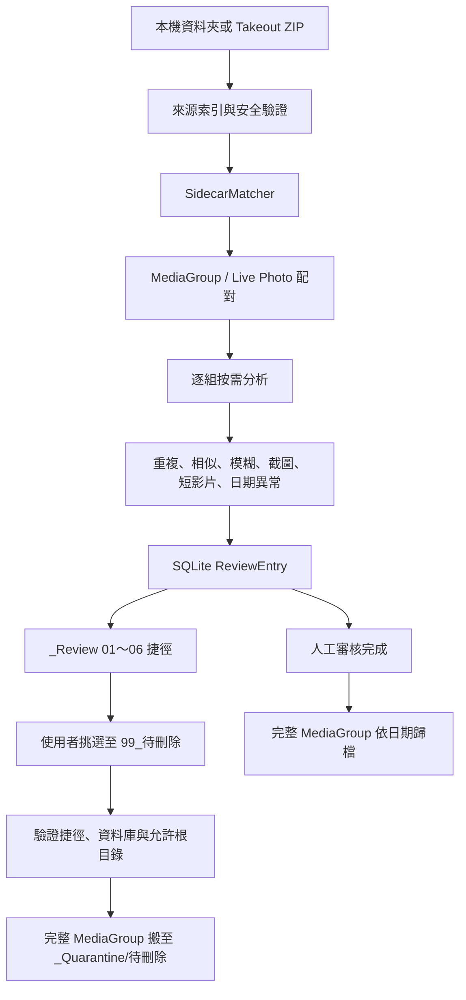

# Smart-Photo-Organizer 架構

## 一、現有可沿用模組

| 模組 | 現有責任 | v3.0 用法 |
|---|---|---|
| `main.py` | WebBridge、一般資料夾整理、DateParser、重複／模糊／截圖與 Windows Shell | 保留協調與既有能力；逐步抽離群組、審核與隔離責任 |
| `takeout_zip.py` | ZIP 唯讀掃描、安全檢查、單檔串流解壓與驗證 | 作為 Takeout 來源介面，補齊共用媒體副檔名 |
| `takeout_index.py` | 跨 ZIP 媒體／JSON 索引與配對 | 配對規則移至共用 `sidecar_matcher.py` 後改為呼叫者 |
| `import_state.py` | SQLite Job、Archive、Member、Sidecar 狀態與續傳 | 擴充 MediaGroup、ReviewEntry、Quarantine 交易狀態 |
| `media_metadata.py` | Sidecar 寫入、截圖評分、媒體日期與目的路徑 | 保留後設資料解析；分類結果改為審核標籤，不直接決定搬移 |
| `index.html` | PyWebView 單頁操作介面 | 先保持可用，Phase 10 才整理為 v3.0 UI |

## 二、目標新增模組

| 模組 | 責任 |
|---|---|
| `sidecar_matcher.py` | 統一一般資料夾與 Takeout ZIP 的 JSON 命名正規化及配對 |
| `media_group.py` | 建立 MediaGroup、Live Photo／RAW 配對與群組完整性驗證 |
| `review_workspace.py` | 建立 `_Review`、`_ReviewCache`、捷徑與 ReviewEntry 狀態 |
| `quarantine_manager.py` | 驗證 `99_待刪除` 後整組搬至 `_Quarantine/待刪除` |
| `similarity.py` | 時間分桶、pHash／dHash 候選比較與相似分群 |

新模組只在對應 v3.0 Phase 開始時新增，不一次建立空殼。

## 三、資料流



## 四、SQLite 權威資料

現有 `jobs`、`archives`、`members`、`sidecar_links` 保留。v3.0 預計新增：

- `media_groups`：群組識別、主要媒體、來源類型與完整性狀態。
- `media_group_members`：群組內每個實體或 ZIP 成員的角色。
- `review_entries`：分類、分數、原因、捷徑路徑、快取路徑與處理狀態。
- `quarantine_actions`：隔離前後路徑、雜湊、交易狀態與錯誤原因。

SQLite 是唯一權威狀態；資料夾名稱、捷徑檔名與 UI 顯示都不是識別主鍵。

## 五、MediaGroup 最小資料模型

```text
MediaGroup
├─ group_id
├─ source_type: FOLDER | TAKEOUT_ZIP
├─ primary_media
├─ members[]
│  ├─ PHOTO | VIDEO | LIVE_PHOTO_VIDEO
│  ├─ GOOGLE_JSON
│  └─ FUTURE_AAE | RAW_PAIR
├─ capture_date / confidence / conflict
├─ content_hash
└─ status
```

## 六、捷徑與安全邊界

- `.lnk` 只指向本機實體媒體或 `_ReviewCache`，不指向 ZIP 虛擬路徑。
- 捷徑檔名包含可讀資訊，但以 SQLite `review_entry_id` 對應為準。
- 「處理待刪除」只接受已登記、仍位於 `_Review/99_待刪除` 且目標落在允許根目錄的捷徑。
- 同一 `group_id` 在單次交易中只隔離一次。
- 搬移前後均核對容量與 SHA-256，失敗時保留可恢復狀態。

## 七、現有設計衝突

1. 現有一般模式與 Takeout IMPORT 會直接搬移／歸檔；v3.0 要先分析與人工審核。
2. 現有截圖、模糊與日期異常是實體隔離；v3.0 改為捷徑分類。
3. 現有 Sidecar 配對分散在 `Processor` 與 `TakeoutIndexer`；v3.0 必須集中。
4. 現有 Live Photo 只靠同 stem 檔案存在判斷，尚未形成可交易的 MediaGroup。
5. UI 仍有 Copy／Move、雲端防下載、GPS 與直接整理控制；需等新流程完成後再移除或改版。

